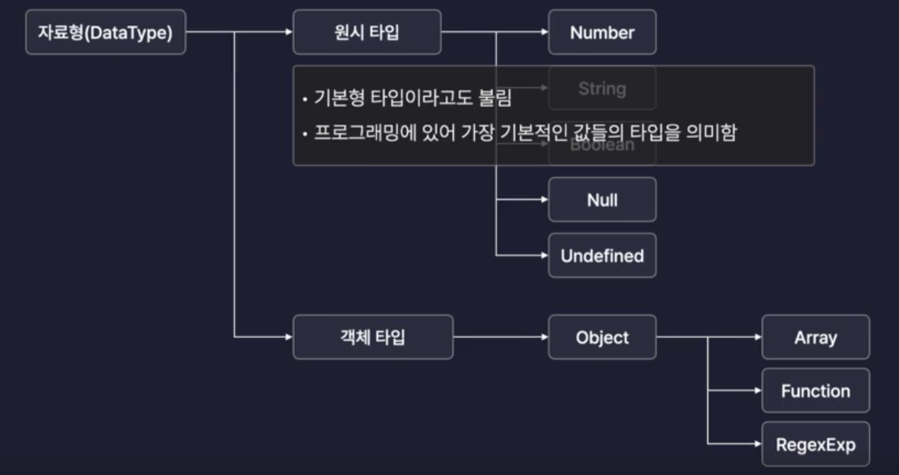

# 자바스크립트

## 자료형

- 원시 타입

- 객체 타입



- 모듈러 연산
  `console.log(num1 % num2) // 0.0`

- NaN

```javascript
// 수치 연산이 실패했을 때 나오는 값 (연산 실패)
let nan = NaN
```

- 템플릿 리터럴 문법

```javascript
// 템플릿 리터럴 문법
let introduceText = `${myName}은 ${myLocation}에 거주합니다` // 이정환은 목동에 거주합니다
```

- null과 undefined

```javascript
// null과 undefined
let nullValue = null // 값이 없음
let undefinedValue = undefined // 값이 지정되지 않으면 초기값이 undefined
```

## 형변환

- 묵시적
  : 자바스크립트 엔진이 자동 변환

- 명시적
  : 개발자가 변환

- `parseInt()` 함수

```javascript
let str2 = "10개"
let strToNum2 = parseInt(str2) // 숫자값이 아닌 값이 있을 때 형변환해주는 내장함수
```

## 연산자

- 증감 연산자

```javascript
let num8 = 10
// 전위 연산
++num8 // 11
// 후위 연산
num8++ // 11 -> 아랫줄에서부터 12로 증가
```

- 논리 연산자

```javascript
let or = true || false // true (1개이상 참)

let and = true && false // false (모두 참)

let not = !true // false (반전)
```

- 비교 연산자

  - === -> 값 + 타입 둘다 같은지 비교
  - == -> 값이 같은지 비교

  ```javascript
  let comp1 = 1 === "1" // false (값과 타입이 같은지 비교)
  let comp2 = 1 !== 2 // true (값과 타입이 다른지 비교)
  ```

- null 병합 연산자
  -> 존재하는 값을 추려내는 기능
  -> null, undefined가 아닌 값을 찾아내는 연산자

```javascript
let var1
let var2 = 10
let var3 = 20

// var1이 null, undefined가 아니면 var1을 반환, 그렇지 않으면 var2를 반환
let var4 = var1 ?? var2 // 10
// var3이 null, undefined가 아니면 var3을 반환, 그렇지 않으면 var2를 반환
let var5 = var1 ?? var3 // 20
// var3이 null, undefined가 아니면 var3을 반환, 그렇지 않으면 var2를 반환
let var6 = var3 ?? var2 // 20
```

- typeof 연산자

  -> 값의 타입을 반환

- 삼항연산자

```javascript
// 활용
// 요구사항 : 변수 res에 var8의 값이 짝수 -> "짝", 홀수 -> "홀"
let res = var8 % 2 === 0 ? "짝수" : "홀수"
console.log(res)
```

## 조건문

- if, else if, else

- switch문
  - 다수의 조건을 처리할 떄 if문보다 가독성이 좋다.

```javascript
let animal = "cat"

switch (animal) {
  case "cat": {
    console.log("고양이")
    break
  }
  case "dog": {
    console.log("강아지")
    break
  }
  default: {
    console.log("그런 동물은 전 모릅니다")
  } // 값이 없을 때 출력
}
// 고양이

// break를 사용하여 조건을 만족하면 탈출
```

```javascript
let animal = "cat"

switch (animal) {
  case "cat": {
    console.log("고양이")
  }
  case "dog": {
    console.log("강아지")
  }
}
// 고양이 강아지

// 참인 조건을 만나면 그 이후 조건도 계속 실행 -> break를 사용하여 조건을 만족하면 탈출
```

## 반복문

- for (초기식, 조건식; 증감식)

## 함수

- 호이스팅 : 함수가 선언되기 전에 호출 가능 / 유연한 프로그래밍 가능

- 함수표현식

```javascript
// 함수를 정의하면서 바로 변수에 할당
// 익명함수로 정의
let varB = function () {
  // 함수 이름이 없고, 변수로 함수를 호출
  //   console.log("funcB");
}

varB()
```

- 화살표 함수

```javascript
// function 키워드를 생략하고 => 기호를 사용하여 함수를 정의
let varC = (value) => {
  console.log(value)
  return value + 1
}

// {} 생략 하는 경우
// let varC = (value) => value + 1
```

- 콜백 함수

: 함수 인자로 들어가는 함수

```javascript
function callTenTimes(callback) {
  for (let i = 0; i < 10; i++) {
    callback()
  }
}
```

- 콜백 함수 활용

```javascript
//구조가 흡사한 함수가 있을 경우, 콜백함수를 사용하여 중복을 줄일 수 있다.
function repeat(count, callback) {
  for (let idx = 1; idx <= count; idx++) {
    callback(idx)
  }
}

repeat(5, (idx) => {
  console.log(idx)
})

repeat(5, (idx) => {
  console.log(idx * 2)
})

repeat(5, (idx) => {
  console.log(idx * 3)
})
```

## 스코프

- 전역 스코프 : 전체 영역에서 접근 가능

- 지역 스코프 : 특정 영역에서만 접근 가능

- 단, 함수 선언식은 함수 블록안에서만 지역 스코프 / 조건문, 반복문은 지역 스코프가 아님 (조건문, 반복문 안에 함수 쓸 일 잘 없음)

```javascript
let a = 1 // 전역 스코프

function funcA() {
  let b = 2 // 지역 스코프
  console.log(a)
}

funcA()
```

## 객체

- 여러 가지 값을 동시에 저장할 수 있는 자료구조

- 현실 세계 표현 용이

- 객체 생성

```javascript
let obj2 = {
  age: 27, // 객체 속성(프로퍼티) -> 키:값
  hobby: "테니스",
}
let obj3 = new Object() // 빈 객체 (사용 잘 안함)
```

- 객체 프로퍼티 접근

  - 3.1 특정 프로퍼티에 접근 (점 표기법, 괄호 표기법)

  ```javascript
  // 점 표기법
  let name = person.name
  // 괄호 표기법 -> 프로퍼티 값이 동적으로 변할 때 사용
  let age = person["age2"] // "" 로 감싸주기
  ```

  - 3.2 새로운 프로퍼티를 추가하는 방법

  ```javascript
  person.job = "fe developer" // job: "fe developer"
  person["favoriteFood"] = "떡볶이" //favoriteFood: "떡볶이"
  ```

  - 3.3 프로퍼티를 수정하는 방법

  ```javascript
  person.job = "educator" // job: "educator"
  person["favoriteFood"] = "초콜릿" // favoriteFood: "초콜릿"
  ```

  - 3.4 프로퍼티를 삭제하는 방법

    - delete 연산자

  ```javascript
  delete person.job
  delete person["favoriteFood"]
  ```

  - 3.5 프로퍼티의 존재 유무를 확인하는 방법 (in 연산자)

  ```javascript
  let result1 = "name" in person
  let result2 = "cat" in person
  console.log(result2) // false
  ```

- 상수 객체

  - 상수 객체는 프로퍼티는 추가, 수정, 삭제 가능 (값 할당만 불가능)

- 메서드

  - 객체 안에 있는 함수

## 배열

- 여러 개의 값을 `순차적`으로 저장할 수 있는 자료구조

- 배열 생성

```javascript
let arr1 = [1, 2, 3, 4, 5] // 배열 리터럴 (대부분 사용)
let arrA = new Array() // 배열 생성자
```
