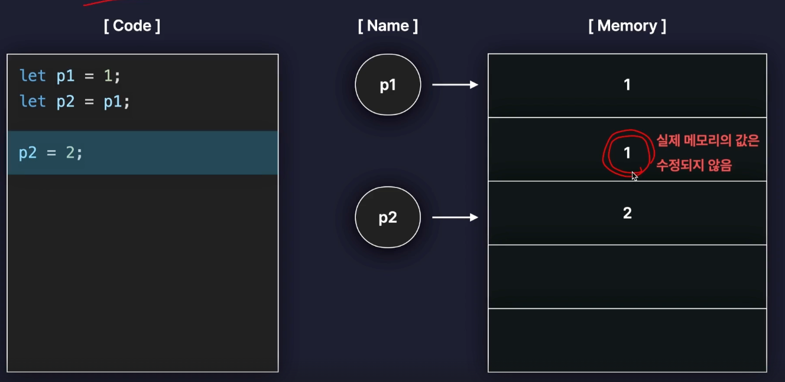
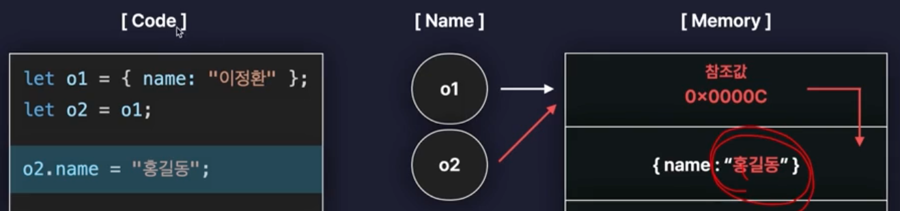
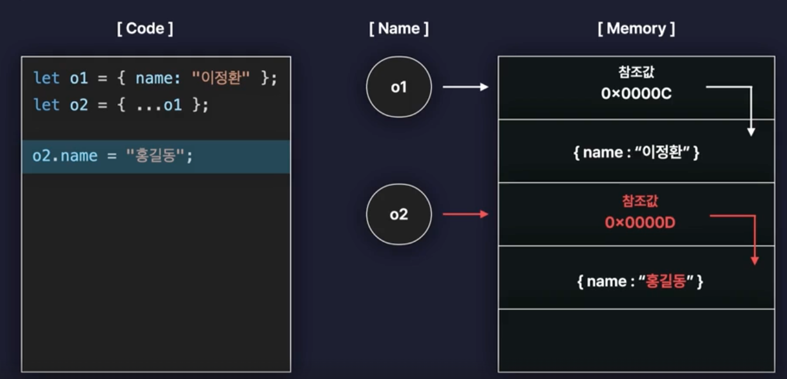
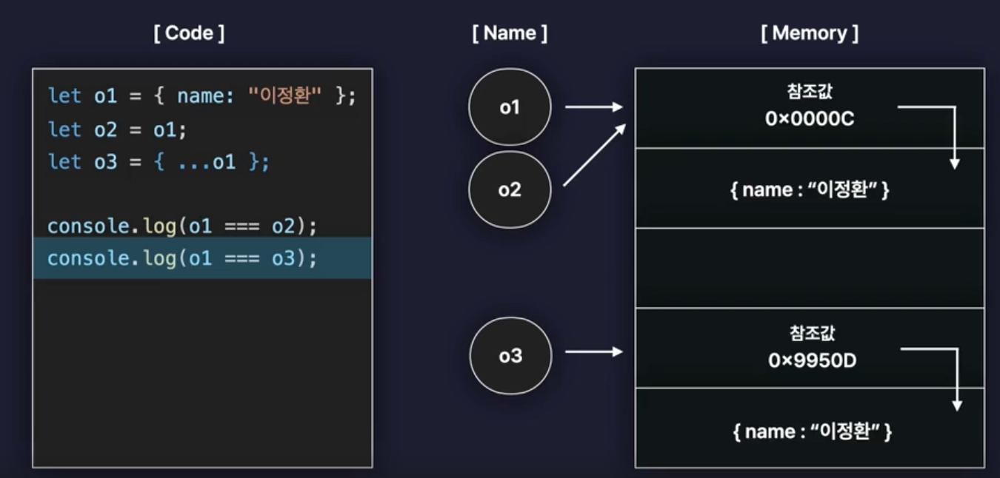

# truthy와 falsy

- 참이나 거짓을 의미하지 않는 값도 조건문 내에서 참 혹은 거짓으로 간주될 수 있다.

- falsy한 값

  - false
  - undefined
  - null
  - 0
  - NaN
  - '' (빈 문자열)

  .. 이외의 값은 모두 truthy한 값

- 활용

  - 웹에서 데이터를 가져올 때 데이터가 없을 수도 있음
  - 그럴 때를 대비해서 truthy, falsy한 값들을 이용해서 조건문을 사용할 수 있음

```javascript
function printName(person) {
  // 객체의 특정 프로퍼티에 접근하는 기능의 함수에서는 조건문으로 매개변수 값이 null, undefined이 아닌지 검사하는 것이 좋다.
  if (!person) {
    console.log("person의 값이 없음")
    // 값이 없거나 정의되지 않았을 때 함수를 종료시켜서 아래의 점 표기법 실행 안해서 오류 방지
    return
  }
  console.log(person.name)
}

let person = { name: "이정환" }
printName(person) // 이정환
```

# 단락 평가 (단축 평가)

- 활용

```javascript
// 단락 평가 활용 사례

function printName(person) {
  // name의 값 -> person이 없으면 undefined -> undefined는 falsy한 값이므로 "person의 값이 없음" 출력
  const name = person && person.name
  // name이 있으면 name 출력, 없으면 "person의 값이 없음" 출력
  // 단락 평가에 의해 person이 없으면 name을 확인하지 않고 "person의 값이 없음" 출력
  console.log(name || "person의 값이 없음")
}

printName() // person의 값이 없음
printName({ name: "이정환" }) // 이정환
```

# 구조 분해 할당 (Destructuring Assignment)

- 배열이나 객체의 속성을 해체하여 그 값을 개별 변수에 담을 수 있게 하는 표현식

- 함수의 매개변수로 구조 분해 할당을 사용할 수 있다.

1. 배열의 구조 분해 할당

```javascript
let arr = [1, 2, 3]

let [one, two, three, four = 4] = arr
console.log(one, two, three, four) // 1 2 3 4

let [one, two, three, four] = arr
console.log(one, two, three, four) // 1 2 3 undefined

let [one, two] = arr
console.log(one, two) // 1 2
```

2. 객체의 구조 분해 할당

```javascript
let person = {
  name: "이정환",
  age: 27,
  hobby: "테니스",
}

let { age: myAge, hobby, name, extra = "hello" } = person // age를 myAge로 바꿔서 받음
console.log(myAge, hobby, name, extra) // 27 테니스 이정환 hello
```

# Spread 연산자와 Rest 매개변수

## spread 연산자

- 배열이나 객체를 펼쳐서 개별 요소로 분리할 수 있게 하는 연산자

- 배열, 객체의 인덱스가 변경될 경우가 있어 일일이 값을 넣어주는 것보다 spread 연산자를 사용하는 것이 편리

```javascript
let arr1 = [1, 2, 3]
let arr2 = [4, ...arr1, 5, 6] // [4, 1, 2, 3, 5, 6]

let obj1 = {
  a: 1,
  b: 2,
}
let obj2 = {
  ...obj1,
  c: 3,
  d: 4,
} // { a: 1, b: 2, c: 3, d: 4 }

function funcA(p1, p2, p3) {
  //   console.log(p1, p2, p3);
}
// 매개변수로 전달할 때 Spread 연산자 사용 (매개변수 3개가 돼..)
funcA(...arr1)
```

## Rest 매개변수

- 함수의 매개변수로 전달된 인수들을 배열로 전달받을 수 있게 하는 문법

- rest 매개변수는 매개변수의 마지막에만 사용 가능

```javascript
// Rest 매개변수 사용
function funcB(one, two, ...ds) {
  console.log(ds) // [3, 4, 5]
}

funcB(...arr1)
```

# 원시타입 VS 객체타입

## 원시타입

- 불변 : 값이 변경되어도 실제 메모리의 값은 수정되지 않음



-> `let p2 = p1;` 으로 p1값을 복사한 다음, `p2 = 2;`로 p2의 값을 변경해도 메모리에는 p1의 값이 그대로 남아있음 => 불변!!

## 객체타입

- 가변 : 객체의 속성을 변경하면 메모리의 값이 변경됨 (얕은 복사)

  - 얕은 복사

  

  -> 객체 타입은 객체 자체를 저장하지 않고 참조값으로 저장 (객체값이 변화할 수 있기 때문에..)

  -> 새로운 변수가 객체 값을 수정하면 참조값이 같기 때문에 다른 변수에도 영향을 미침 => 가변!!

- 객체 값이 의도치 않게 수정될 수 있다 (side effect) -> 깊은 복사로 해결

  - 깊은 복사

  

  - spread 연산자처럼 새로운 객체를 생성하면서 내부 프로퍼티를 복사라는 방식으로 객체를 복사해야함

  - 그래야 메모리 상에서 새로운 객체로 저장돼서 객체 값이 수정되어도 원본 객체에 영향을 미치지 않음

- 객체 간의 비교는 기본적으로 참조값을 기준으로 이뤄짐

  

  - o1 === o2 는 true가 나옴 / o1과 o2는 같은 객체를 참조하고 있기 때문

  - o1 === o3 는 false가 나옴 / o1과 o3는 다른 객체를 참조하고 있기 때문

  -> 객체 간의 비교는 참조값으로 이뤄짐 (단순히 값이 같다고 같다고 평가 x)

  -> 객체의 프로퍼티(참조값)가 같은지 비교하려면 깊은 복사를 통해 비교해야함

  - JSON.stringify() : 객체를 문자열로 변환해서 비교할 수 있음 (깊은 비교)

  ```javascript
  let o1 = { name: "kim" }
  let o2 = { name: "kim" }
  let o3 = o1

  console.log(o1 === o2) // false
  console.log(o1 === o3) // true

  console.log(JSON.stringify(o1) === JSON.stringify(o2)) // true
  ```

- 배열과 함수 또한 객체 타입에 속함

# 반복문으로 배열과 객체 순회하기

- `.length` -> 배열의 길이를 저장하는 프로퍼티(속성)

## 배열 순회 (for...of)

- 인덱스

- `for...of`

## 객체 순회 (for...in)

- `Object.keys`

  -> 객체에서 key 값들만 뽑아서 새로운 배열로 반환

  ```javascript
  let keys = Object.keys(person)
  console.log(keys) // ["name", "age", "hobby"]
  ```

- `Object.values`

  -> 객체에서 value 값들만 뽑아서 새로운 배열로 반환

  ```javascript
  let values = Object.values(person)
  console.log(values) // ["이정환", 27, "테니스"]
  ```

- `for...in`

  -> 객체의 key, value 값에 접근할 수 있음

  ```javascript
  for (let key in person) {
    const value = person[key]
    console.log(key, value)
  }
  ```

# 배열 메서드1. 요소 조작

1. push

- 배열의 맨 뒤에 새로운 요소를 추가하는 메서드

2. pop

- 배열의 맨 뒤에 있는 요소를 제거하고, 반환

- shift와 unshift는 push와 pop보다 느리다

3. shift

- 배열의 맨 앞에 있는 요소를 제거, 반환

4. unshift

- 배열의 맨 앞에 새로운 요소를 추가하는 메서드

5. slice

- 마치 가위처럼, 배열의 특정 범위를 잘라내서 새로운 배열로 반환

6. concat

- 두개의 서로 다른 배열을 이어 붙여서 새로운 배열을 반환

# 배열 메서드2. 순회와 탐색

- forEach

  - 모든 요소를 순회하면서, 각각의 요소에 특정 동작을 수행시키는 메서드

  - 콜백함수랑 같이 사용

  - forEach(현재 요소, 현재 인덱스, 배열 전체)

- includes

  - 배열에 특정 값이 있는지 확인하는 메서드

- indexOf (얕은 비교)

  - 특정 요소의 인덱스(위치)를 찾아서 반환하는 메서드

  - 객체 타입의 값이 저장된 배열은 요소의 인덱스를 찾을 수 없다. (얕은 비교)

- findIndex

- 모든 요소를 순회하면서, 콜백함수를 만족하는 그런

- 특정 요소의 인덱스(위치)를 반환하는 메서드

- 콜백 함수를 이용해서 깊은 비교 (참조값을 사용해서 비교함)

- find

  - 모든 요소를 순회하면서 콜백함수를 만족하는 요소를 찾는데, 요소(객체)를 그대로 반환

## 배열 메서드 3. 배열 변형

1. filter

- 기존 배열에서 조건을 만족하는 요소들만 필터링하여 새로운 배열로 반환

- 웹 개발 시, 데이터를 가져와서 특정 조건에 맞는 데이터만 필터링해서 사용할 때 사용

2. map

- 배열의 모든 요소를 순회하면서, 각각 콜백함수를 실행하고 그 결과값들을 모아서 새로운 배열로 반환

- map(현제 요소, 현재 인덱스, 배열 전체)

3. sort

- 원본 배열을 정렬

- 배열을 사전순으로 정렬하는 메서드

- 숫자의 대소 관계를 비교하려면 콜백함수를 사용해야 함

4. toSorted (가장 최근에 추가된 최신 함수)

- 정렬된 새로운 배열을 반환하는 메서드

5. join

- 배열의 모든 요소를 하나의 문자열로 합쳐서 반환하는 그런 메서드

- join(구분자)

# Date 객체와 날짜

- 날짜와 시간을 다루는 객체

- Date 객체 생성

  - `new Date()` : 현재 시간을 나타내는 Date 객체 생성

  - `new Date(유닉스 타임)` : 유닉스 타임을 이용해서 Date 객체 생성

  - `new Date(년, 월, 일, 시, 분, 초, 밀리초)` : 특정 시간을 나타내는 Date 객체 생성

## 타임 스템프

- 1970년 1월 1일 00:00:00 UTC 기준으로부터 경과한 시간을 밀리초 단위로 나타낸 값

- `getTime()` : utc 타임을 반환하는 메서드

```javascript
let ts1 = date1.getTime()
let date4 = new Date(ts1)

// 둘 다 같은 타임 스탬프를 가지고 있음
console.log(date1, date4)
```

## 시간 요소 추출

- 자바스크립트에서는 1월이 0부터 시작

  - `getFullYear()` : 년도

  - `getMonth()` : 월 (0부터 시작)

  - `getDate()` : 일

  - `getDay()` : 요일 (0: 일요일, 1: 월요일, ...)

  - `getHours()` : 시

  - `getMinutes()` : 분

  - `getSeconds()` : 초

  - `getMilliseconds()` : 밀리초

## 시간 수정

```javascript
date1.setFullYear(2023)
date1.setMonth(2) // 3월
date1.setDate(30)
date1.setHours(23)
date1.setMinutes(59)
date1.setSeconds(59)
```

## 시간을 여러 포맷으로 출력하기

```javascript
console.log(date1.toDateString()) // 2023-03-30
// 현지화 시간으로 출력
console.log(date1.toLocaleString()) // 2023-03-30 23:59:59
```

# 동기와 비동기

- 쓰레드 : 프로그램이 동작하게 되면서 실행되는 흐름의 단위

- 동기 : 작업을 순서대로 실행 (쓰레드)

- 비동기 : 작업을 순서대로 실행 안함 (멀티 쓰레드)

  -> 자바스크립트는 기본적으로 동기적으로 실행, 그러나 비동기를 가능하게 하는 WED API를 제공

  - WED API : 브라우저에서 제공하는 API / 비동기적으로 작업을 수행할 수 있게 해줌

- `setTimeout(콜백함수, 일정 시간)` : 일정 시간이 지난 후에 콜백함수를 실행하는 함수

# 비동기 작업 처리하기 1. 콜백함수

- 비동기 작업1의 결과를 또다른 비동기 작업2의 인수로 전달하는 방법

- // but, 이렇게 히면 콜백 지옥.. -> Promise 사용!

```javascript
function add(a, b, callback) {
  setTimeout(() => {
    const sum = a + b /// 3
    callback(sum)
  }, 1000)
}

add(1, 2, (result) => {
  console.log(result) // 3
})
```

# 비동기 작업 처리하기 2. Promise

- 비동기 작업을 도와주는 JS 내장 객체

- 비동기 작업들을 감싸고 있는게 Promise

- api를 사용할 때, Promise 객체를 반환하고 then, catch 메서드를 사용해서 비동기 작업의 성공, 실패를 처리

  - `new Promise((resolve, reject) => {})` : resolve, reject는 함수

  - then, catch 메서드를 사용해서 비동기 작업의 성공, 실패를 처리

- `new Promise((resolve, reject) => {})` // resolve, reject는 함수

- then, catch 메서드를 사용해서 비동기 작업의 성공, 실패를 처리

  - `then` : 성공 시 호출 / promise 객체를 반환 -> 콜백 지옥 방지

  - `catch` : 실패 시 호출

- 성공(대기 -> 이행) 시 결과값을 resolve / 실패(대기 -> 거부) 시 에러를 reject

- Promise 3가지 상태

  - 대기 (pending) : 비동기 작업이 아직 수행되지 않은 상태

  - 이행 (fulfilled) : 비동기 작업이 성공적으로 수행된 상태

  - 거부 (rejected) : 비동기 작업이 실패한 상태

# 비동기 작업 처리하기 3. async, await

## async

- 함수 앞에 async 키워드를 붙이면 해당 함수는 비동기 함수가 됨

## await

- async 함수 내부에서만 사용 가능 / 비동기 함수가 끝날 때까지 기다림
