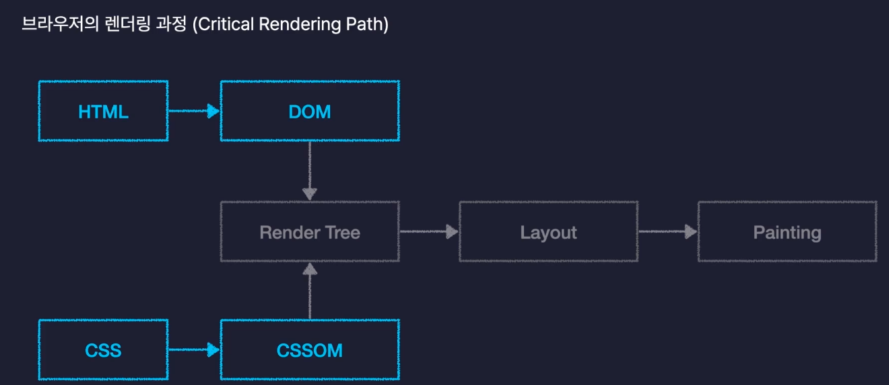
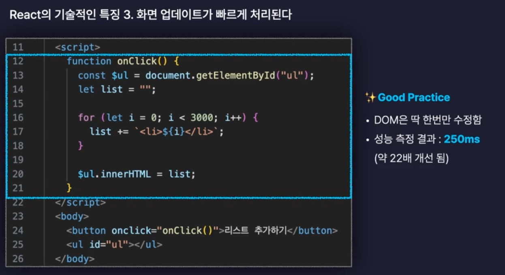

# React + Vite

This template provides a minimal setup to get React working in Vite with HMR and some ESLint rules.

Currently, two official plugins are available:

- [@vitejs/plugin-react](https://github.com/vitejs/vite-plugin-react/blob/main/packages/plugin-react/README.md) uses [Babel](https://babeljs.io/) for Fast Refresh
- [@vitejs/plugin-react-swc](https://github.com/vitejs/vite-plugin-react-swc) uses [SWC](https://swc.rs/) for Fast Refresh

## 리액트 특징

1. 컴포넌트 기반으로 ui를 구성

- 컴포넌트 : 재사용 가능한 코드 블록

2. 화면 업데이트 구현이 쉬움

- 선언형 프로그래밍 : 과정 생략, 목적을 명시 (그냥 식당에서 주문하듯이 간단) -> 리액트

- 명령형 프로그래밍 : 과정을 명시, 목적 생략 (레시피를 따라 요리하는 것처럼 복잡) -> 자바스크립트

3. 화면 업데이트가 빠르게 처리

- 브라우저 렌더링 과정 (critical rendering path) : HTML, CSS, JS -> DOM(요소의 위치, 배치, 모양 정보), CSSOM (요소의 스타일 관련 정보)-> Render Tree (웹페이지의 청사진) -> Layout (요소의 배치를 잡아내는 것) -> Paint (실제로 화면에 그려내는 과정)

- 화면 업데이트 : 자바스크립트가 dom을 수정하면 업데이트 ㅇ

- reflow : 레이아웃이 변경되면 레이아웃을 재계산하는 과정
- repaint : 레이아웃이 변경되면 다시 그리는 과정
  - -> 이 기능은 오래 걸림..

-> 가상돔을 사용해서 dom 수정을 최소화 해줌
