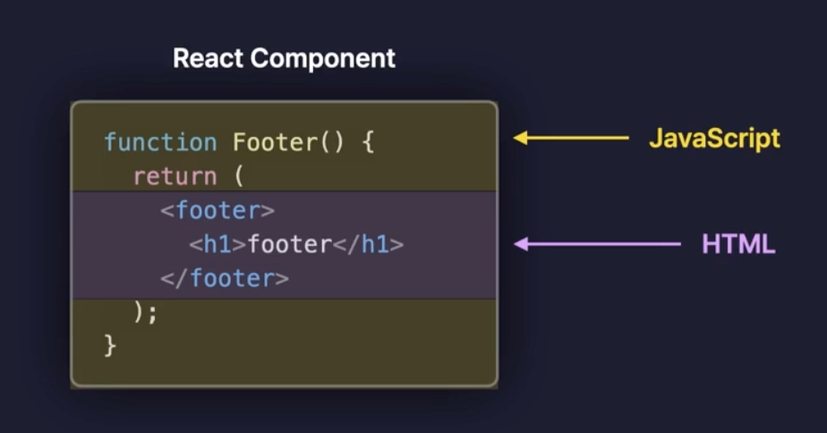
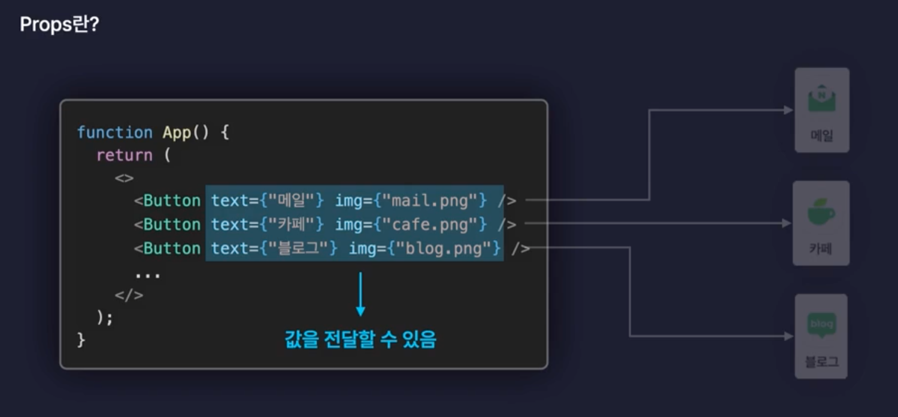
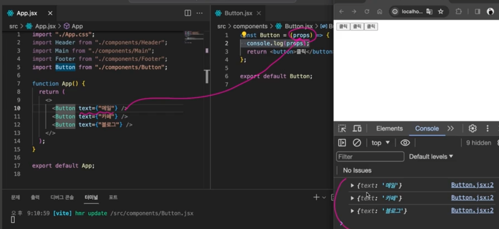
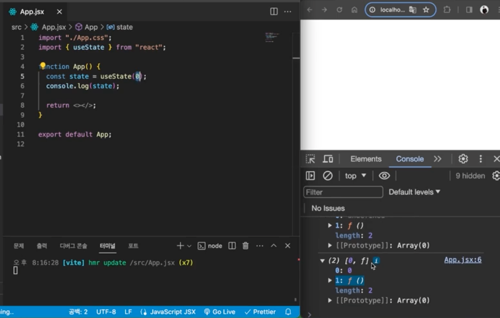

# 5. 리액트 입문

## 설정

#### ESLint

- 잘못된 코드가 있으면 에러를 표시해주는 린트 도구

#### .eslintrc.cjs 설정법

- rules에 "no-unused-vars": "off" 추가 -> 코드상에 실제로 사용하지 않는 변수가 있을 때 오류를 알려줌

- "react/prop-types": "off" -> prop-types를 사용하지 않아도 오류를 표시하지 않음

## components

- 각 컴포넌트를 담는 폴더

- 일반적으로 App 컴포넌트를 루트 컴포넌트로 사용

## JSX



- 자바스크립트의 확장 문법

- 효율적으로 UI를 구성할 수 있는 리액트의 문법

- html 요소에 {}를 사용하여 자바스크립트 표현식을 사용할 수 있음

  - 조건문, 반복문 등을 사용할 수 없음

  - 숫자, 문자열, 배열 값만 렌더링 됨 (t, f, null, undefined, 객체는 렌더링 되지 않음)

  - 모든 태그는 닫혀있어야 함

  - 최상위 태그는 1개여야만 함 (빈태그 `<>` `</>` 사용 가능)

```jsx
const number = 1;

h1>안녕하세요 {number}</h1> // 안녕하세요 1
```

## css 적용

### css 주의 사항

1. Main.css 파일을 만들어서 css를 적용할 경우, class 대신 className을 사용한다 (리액트에서 class는 예약어이기 때문)

2. 태그 안에 스타일을 적용할 때는 객체 형태로 작성 + 카멜 표기법 사용

```jsx
if (user.isLogin) {
  return <div className="logout">로그아웃</div>
} else {
  return <div>로그인</div>
}
```

## props



- 부모 컴포넌트에서 자식컴포넌트로 데이터를 전달할 때 사용



- Props 전달: App.jsx에서 Button 컴포넌트를 호출하며 서로 다른 text 값을 전달 / `<Button text={"메일"} />`에서 객체인 text를 전달

- Props 접근: Button.jsx에서 props 객체를 통해 부모가 전달한 데이터를 확인하고 사용

## 이벤트 핸들링

웹 내부에서 발생하는 사용자 행동

- 합성 이벤트 객체

  - 모든 브라우저에서 동일한 이벤트 객체를 사용할 수 있게 함 (cross-browser 문제에서 자유롭게 함)

  - 브라우저마다 이벤트 객체가 다르기 때문에 리액트에서는 합성 이벤트 객체를 통해 통일된 이벤트 객체를 사용할 수 있게 함

## State

![img] (./image/4.png)

- 컴포넌트 내부에서 바뀔 수 있는 값을 관리

- state를 갖는 컴포넌트는 state의 값에 따라서 ui를 업데이트 함 (상태 변화시, 리렌더링)

- `import { useState } from "react";` -> useState 함수를 사용하여 state를 사용할 수 있음



- useState 함수 : 배열을 반환하며, 첫 번째 원소는 state 값, 두 번째 원소는 state를 업데이트하는 함수 = 상태변화 함수

- 상태변화 함수 : state를 업데이트할 때는 상태변화 함수를 사용하여 업데이트함

- 리엔더링이 발생하는 상황

  - state가 업데이트되면 컴포넌트는 리렌더링됨

  - 제공받은 props가 변경되면 컴포넌트는 리렌더링됨

  - 부모 컴포넌트가 리렌더링되면 자식 컴포넌트는 리렌더링됨
