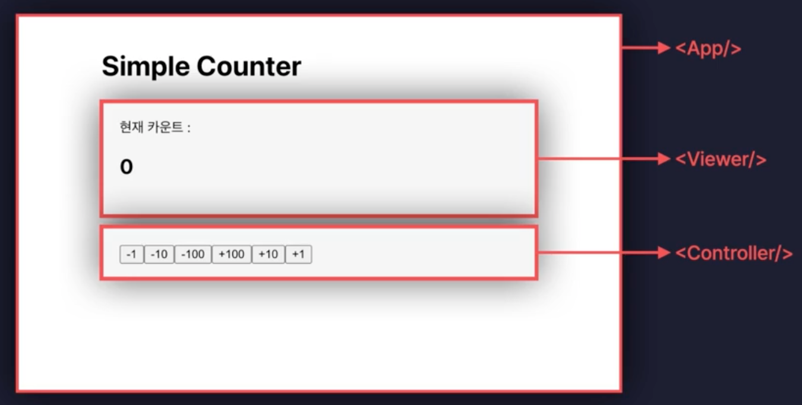

# 프로젝트 1 : 카운터 앱



## 초기 셋팅

1. Vite 프로젝트 생성

```bash
$ npx create vite@latest
```

- 프로젝트명 입력 -> JS 선택

- 프로젝트 생성 완료 후 프로젝트 폴더로 이동

2. 필요한 라이브러리 설치

```bash
$ npm install
$ npm i
```

3. 프로젝트 실행

```bash
$ npm run dev
```

4. 불필요한 파일 삭제 + 각종 설정

1) ESLint 설정

- `.eslintrc.cjs` 파일

```js
rules:{
  no-unused-vars: "off",
  react/prop-types: "off",
}
```

2. 파일 삭제

#### public 폴더 생성

- public/vite.svg

#### assets 폴더 생성

- assets/react.svg 삭제

- assets/App.jsx

  - return문 안에 코드 삭제

  - import문 삭제 / useState, useEffect 삭제

  - reture문 안에 카운터 앱 렌더링 설정

  ```jsx
  return <>카운터앱</>
  ```

- assets/index.css

  - css 코드 삭제

- assets/App.css

  - css 코드 삭제

- assets/main.js
  - 스트릭트 모드 삭제

## UI 구현

1. components 폴더 생성

1) View.jsx 파일 생성

```jsx
const Viewer = () => {
  return <div>counterapp</div>
}
export default Viewer
```

- App.jsx 파일
  - Viewer 컴포넌트 import
  - <Viewer/> 컴포넌트 렌더링

2. Cotroller.jsx 파일 생성

```jsx
const Controller = () => {
  return <div>controller</div>
}
export default Controller
```

- App.jsx 파일
  - Controller 컴포넌트 import
  - <Controller/> 컴포넌트 렌더링

3. App.jsx 파일

- Viewer, Controller 컴포넌트를 section 태그로 감싸기

- 각 컴포넌트들마다 백그라운드와 내부 여백을 적용해주기 위해서..

4. App.css 파일

1) 최상위 태그 div로 감싸서 claddName을 적용할 수 있도록 수정

```jsx
return (
  <div className="App">
    <h1>Simple Counter</h1>
    <section>
      <Viewer count={count} />
    </section>
    <section>
      <Controller onClickButton={onClickButton} />
    </section>
  </div>
)
```

2. css

- App.css 적용

## 기능 구현

1. 카운트 기능 구현

- 카운트 값을 state로 관리
- state값이 변경돼야 화면이 다시 렌더링되도록 설정

- 카운트 기능 -> `App.jsx 파일`에서 구현

- why?? state값을 가장 상위 컴포넌트인 App.jsx에서 관리해야 변경된 값을 하위 컴포넌트에 전달할 수 있기 때문 (props로 전달하기 때문..) -> state lifting

#### state lifting

: 상위 컴포넌트에서 state를 관리하고 하위 컴포넌트에 props로 전달하는 방식

: 데이터기 상위 -> 하위로 단방향으로 흐름 (이걸 고려해섯 코드 짜기)

```jsx
// useState 함수를 import
import { useState } from "react"

function App() {
  // 카운트 기능 (Viewer 컴포넌트에 전달할 state)
  const [count, setCount] = useState(0)

  // 이벤트 핸들러 함수 (Controller 컴포넌트에 전달할 함수) / 카운트 증가, 감소 함수

  // value -> 버튼의 숫자 값

  const onClickButton = (value) => {
    setCount(count + value)
  }
}
```

2. 이벤트 핸들러 함수 태그에 적용

- App.jsx 파일에 있는 onClickButton 함수를 Controller 컴포넌트에 전달

`Controller.jsx 파일`

- 버튼 클릭 시 onClickButton 함수에 담긴 -1 인자(=버튼의 숫자)와 함꼐 함수 호출

- 화살표 함수를 이벤트 핸들러로 설정 -> 이벤트 핸들러에서 함수를 호출해서 인자를 전달 (함수에 인자를 전달하려면 화살표 함수를 사용해야 함)

```jsx
<button
  onClick={() => {
    onClickButton(-1)
  }}
>
  -1
</button>
```
