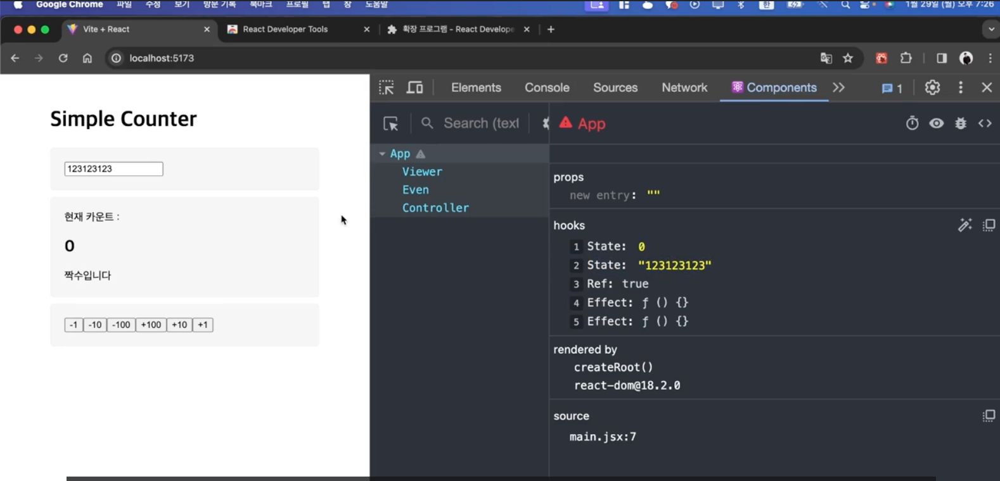
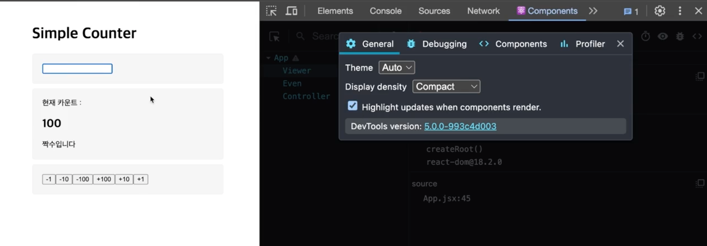

# 라이프 사이클

## 라이프 사이클?

- 컴포넌트의 생성, 삭제, 그리고 갱신 등의 과정을 의미

#### Mounting

: 컴포넌트가 처음 렌더링
: 서버에서 데이터를 불러오거나, DOM 요소에 이벤트를 추가하는 등의 작업을 수행

#### Updating

: 컴포넌트가 업데이트 (리렌더링)
: `props` 또는 `state`가 변경되었을 때 발생

#### Unmounting

: 컴포넌트가 화면에서 사라짐
: 이벤트 제거, 상태 초기화 등의 작업을 수행, 메모리 정리

## useEffect

- 컴포넌트의 사이드 이펙트(컴포넌트에 변화가 있을 때, 부수적이고 파생적인 효과)를 제어하는 hook

- `import { useEffect } from 'react';`

- `useEffect(콜백함수, 배열)` -> 두 번째 인자로 전달된 배열이 변경될 때, 콜백함수 실행

- 배열 -> 의존성 배열(dependency array == deps)

```jsx
useEffect(() => {
  // 실행할 코드
}, [변경 감지할 값]); // 의존성 배열(dependency array == deps)
```

- `setContent 함수`는 비동기적.. -> 사이드 이펙트 처리가 바로바로 안됨 -> `useEffect`를 사용하여 비동기적인 작업을 처리

### useEffect로 라이프 사이클 제어하기

- `useEffect`를 사용하여 라이프 사이클 제어 가능

- 클린업, 정리 함수 : `useEffect`가 끝나면 작동하는 함수 / 컴포넌트가 사라질 때 작동

## 리액트 개발자 도구 사용법

- React 개발자 도구 다운로드 링크 :

https://chrome.google.com/webstore/detail/react-developer-tools/fmkadmapgofadopljbjfkapdkoienihi?hl=ko

- 크롬 설정 -> 확장 프로그램 -> React Developer Tools -> 허용

- 사이트 액세스 -> 모든 사이트에서

- 파일 URL에 대한 액세스 허용 -> 파일 URL에 대한 액세스 허용

-> 이제 개발자 도구에서 사용가능!!!


-> props, state, context, hooks, etc... 확인 가능



-> 컴포넌트의 리렌더링이 발생했을 때, 하이라이트로 표시

-> 불필요한 리렌더링을 찾기 쉬움
