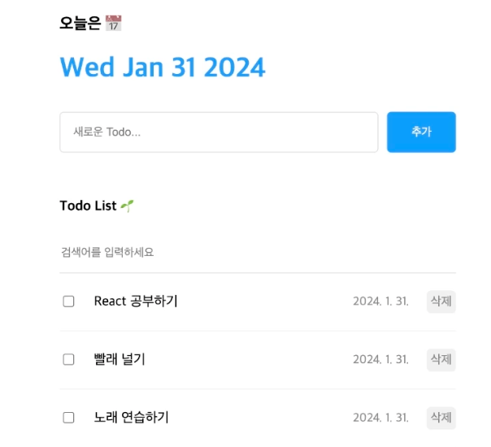

# 투두 리스트

TodoList 데모사이트 링크 :

https://chapter7-dun.vercel.app/



## 개발환경 세팅

1. 프로젝트 생성

```bash
$ npx create vite@latest
```

-> 리액트, 자바스크립트 선택

- 해당 프로젝트로 이동

2. 라이브러리 설치 및 리액트 실행

```bash
$ npm i
```

```bash
npm run dev
```

3. ESSLint 설정, 필요없는 파일 제거

```cjs
rules: {
  "no-unused-vars": "off",
  "react/prop-types": "off",
}
```

## UI 구성

1. 컴포넌트 구성

- 헤더, 에디터, 리스트 컴포넌트 필요

  - `App.jsx`의 기본 구성

  ```jsx
  import "./App.css"

  function App() {
    return <>TodoList </>
  }

  export default App
  ```

  - App.jsx에서 `Header` 컴포넌트를 사용하기 위해 import

  ```jsx
  // 자식 컴포넌트를 import해야 App 컴포넌트에서 사용 가능
  import Header from "./components/Header"

  function App() {
    return (
      <>
        <Header />
      </>
    )
  }

  export default App
  ```

  - `자식 컴포넌트`의 기본 구성

  ```jsx
  const Header = () => {
    return (
      <div>
        <h1>TodoList</h1>
      </div>
    )
  }

  export default Header
  ```

2. 컴포넌트.css 파일 생성

#### 컴포넌트.css 파일 생성 후, 컴포넌트에 import

- `import "./App.css"` : App.css 파일을 App.jsx 에 import

- App.jsx : 스타일 적용하고 싶은 태그에 className을 추가

- App.css : 스타일링

#### 스타일링

- display:flex 관련 아티클

  https://one-step-js.hyobb.com/6ae9fe72-81b5-491b-8b8e-dc50c4c9be16#c0a0b3c0a2494bb78d7f3c88e9f048c9

  ```css
  .App {
    /* 요소들을 화면 가운데 배치 */
    width: 500px;
    margin: 0 auto;

    display: flex; /* 자식 요소를 가로로 배치 (자식요소 구성을 용이하게 해줌) */
    flex-direction: column; /* display를 열 기준으로 세로로 요소 배치 */
    gap: 10px; /* display: flex;가 적용된 요소간의 간격을 생성  */
  }
  ```

##### css 선택자

- `.Editor > input{}` : 직접적인 자식 요소만!!! 선택할 때 사용

- `.Editor  input{}` : 모든 하위 input 태그에 적용

  ```css
  /* Header 컴포넌트에 있는 h1 태그에 스타일을 적용 */
  .Header > h1 {
    color: rgb(37, 147, 255);
  }
  ```

- `:focus` : 특정 요소에 포커스를 맞추었을 때 적용되는 상태

  ```css
  <!-- HTML -->
  <!-- <input placeholder="검색어를 입력하세요" /> -->

  .Editor > input:focus {
    border-color: rgb(37, 147, 255);
    <!-- 포커스가 있을 때만 배경색 변경 -->
  }
  ```

- 이모지 아이콘

  - 윈도우 : `윈도우키 + .`
  - 맥 : `control + command + space`

## 기능 구현

- todoitem을 state로 관리 -> todoitem을 추가, 삭제, 수정하면 화면에 바로 반영!! / app.jsx에서 관리

  ```jsx
  // App 컴포넌트에서 사용할 초기 데이터 (임시 데이터)
  // 각 todo를 객체로 관리
  const mockData = [
    {
      id: 0, // 고유 id
      isDone: false, // 체크박스
      content: "React 공부하기", // 내용
      date: new Date().getTime(), // 생성날짜 / 타임스템프 사용
    },
  ]

  function App() {
    // state로 todos 배열을 관리
    // mockData를 초기값으로 설정 -> 화면이 처음 렌더링되면 mockData가 화면에 출력
    const [todos, setTodos] = useState(mockData)
  }
  ```

  ### todo CRUD

  - Editor 컴포넌트에서 입력한 내용(content)을 받아서 todos 배열에 추가 (onCreate)

  - props로 Editor 컴포넌트에 함수를 전달

  ```jsx
  const onCreate = (content) => {
    const newTodo = {
      id: idRef.current++,
      isDone: false,
      content: content,
      date: new Date().getTime(),
    }

    // push 대신 상태변화함수인 setTodo를 사용해야 인수로 받은 데이터를 todos 배열에 추가할 수 있음
    // 그래야 리액트가 상태변화를 감지하고 화면을 다시 렌더링함 (setState 함수를 사용해야 함)
    setTodos([newTodo, ...todos]) // 새로 추가한 todo + 기존 todos 배열 (스프레드 연산자 사용)
  }

  return (
    <div className="App">
      <Editor onCreate={onCreate} /> {/* props로 데이터 전달 */}
      {/* props 변수명 = 부모컴포넌트의 함수 */}
    </div>
  )
  ```

  ### Create

  #### 1. 주요 흐름

  1. **Editor에서 입력** → **App의 `onCreate` 호출** → **`todos` 상태 업데이트** → **UI 리렌더링**.

  ***

  #### 2. 소소기능 3개

  1. **입력값 없을 때 포커스 이동**:

     - `inputRef.current.focus()`를 사용해 입력창으로 다시 포커스.

  2. **Enter 키로 Todo 추가**:

     - `onKeydown` 이벤트로 Enter 키 입력 시 `onSubmit` 호출.

  3. **입력값 초기화**:

     - Todo 추가 후 `setContent("")`로 입력창 초기화.

  ***

  #### 3. 핵심 코드

  - **App.jsx**

    ```jsx
    const onCreate = (content) => {
      const newTodo = {
        id: idRef.current++, // 고유 ID 생성
        isDone: false,
        content,
        date: new Date().getTime(), // 생성 시간
      }
      setTodos([newTodo, ...todos]) // 상태 업데이트
    }
    ```

  - **Editor.jsx**

    ```jsx
    const onSubmit = () => {
      if (content === "") {
        inputRef.current.focus() // 입력값 없으면 포커스
        return
      }
      onCreate(content) // App의 onCreate 호출
      setContent("") // 입력값 초기화
    }

    const onKeydown = (e) => {
      if (e.keyCode === 13) onSubmit() // Enter 키 처리
    }
    ```

  #### 4. 복습 포인트

  - **상태 업데이트**: `setTodos([newTodo, ...todos])`
  - **고유 ID 관리**: `useRef` 사용 (`idRef.current++`)
  - **소소기능**: 포커스 이동, Enter 키 추가, 입력값 초기화

### Read

#### 1. 주요 흐름

1. **`App`에서 todos 데이터 전달** → **`List` 컴포넌트에서 검색 및 필터링** → **`TodoItem` 컴포넌트로 렌더링**.

---

#### 2. 주요 기능

1. **검색 기능 (List.jsx)**:

   - 사용자가 입력한 검색어를 기반으로 `todos`를 필터링.
   - **코드**:
     ```jsx
     const getFilteredData = () => {
       if (search === "") return todos
       return todos.filter((todo) => todo.content.toLowerCase().includes(search.toLowerCase()))
     }
     ```

2. **Todo 렌더링 (List.jsx)**:

   - 필터링된 Todo 리스트를 `map`으로 반복 처리해 `TodoItem` 컴포넌트로 렌더링.
   - 각 Todo는 고유한 `key` 값을 사용.
   - **코드**:
     ```jsx
     {
       filteredTodos.map((todo) => <TodoItem key={todo.id} {...todo} onUpdate={onUpdate} onDelete={onDelete} />)
     }
     ```

3. **Todo 상세 렌더링 (TodoItem.jsx)**:

   - Todo의 상태(`isDone`)를 체크박스로 표시하고, `content`와 `date`를 보여줌.
   - **코드**:
     ```jsx
     <input
       onChange={onChangeCheckbox}
       readOnly
       checked={isDone}
       type="checkbox"
     />
     <div className="content">{content}</div>
     <div className="date">{new Date(date).toLocaleDateString()}</div>
     ```

#### 3. 소소기능

1. **검색어 대소문자 무시**:

   - `toLowerCase()`를 사용해 대소문자 구분 없이 검색.

2. **검색어 없을 때 전체 출력**:

   - `if (search === "") return todos;`로 검색어가 비어있으면 전체 데이터를 출력.

3. **고유 `key` 설정**:

   - React의 리스트 렌더링 최적화를 위해 Todo의 `id`를 `key`로 사용.

#### 4. 복습 포인트

- **상태 전달**: `App`에서 `todos`, `onUpdate`, `onDelete`를 `List`로 전달.
- **검색 기능**: 입력한 검색어로 `todos` 배열을 필터링.
- **렌더링**: 필터링된 `todos`를 `TodoItem` 컴포넌트로 표시.

### Update

#### 1. 주요 흐름

1. **TodoItem의 체크박스 클릭** → **`onUpdate` 호출** → **`todos` 상태 업데이트** → **UI 리렌더링**.

---

#### 2. 주요 기능

1. **체크박스 상태 업데이트 (`App.jsx`)**:

   - **`onUpdate` 함수**:
     - `todos` 배열을 순회하며 `id`가 일치하는 Todo의 `isDone` 값을 반대로 변경.
     - 새로운 배열로 상태를 업데이트하여 React가 UI를 다시 렌더링.
     - **코드**:
       ```jsx
       const onUpdate = (targetId) => {
         setTodos(todos.map((todo) => (todo.id === targetId ? { ...todo, isDone: !todo.isDone } : todo)))
       }
       ```

2. **체크박스 이벤트 핸들링 (`TodoItem.jsx`)**:

   - **`onChangeCheckbox` 함수**:
     - 체크박스 클릭 시 `onUpdate`를 호출해 Todo의 `isDone` 값을 변경.
     - **코드**:
       ```jsx
       const onChangeCheckbox = () => {
         onUpdate(id)
       }
       ```

3. **`isDone` 값에 따라 UI 변경 (`TodoItem.jsx`)**:
   - **체크박스 상태와 연결**:
     - `checked` 속성에 `isDone` 값을 연결하여 상태에 따라 체크 여부가 반영.
     - **코드**:
       ```jsx
       <input onChange={onChangeCheckbox} readOnly checked={isDone} type="checkbox" />
       ```

---

#### 3. 소소기능

1. **`isDone` 값 토글**:
   - 클릭 시 `!todo.isDone`로 현재 상태를 반전.
2. **상태 변경만 반영**:
   - 배열 전체를 새로 생성하지 않고 변경된 Todo만 업데이트.
3. **체크박스와 UI 연동**:
   - `checked` 속성을 통해 상태를 반영.

---

#### 4. 복습 포인트

- **체크박스 이벤트**: `onChange`로 `onUpdate` 호출.
- **상태 업데이트**: `map`과 스프레드 연산자로 상태 변경.
- **UI와 상태 연동**: `checked={isDone}`로 상태 반영.

---

### Delete

#### 1. 주요 흐름

1. **TodoItem의 삭제 버튼 클릭** → **`onDelete` 호출** → **`todos` 상태 업데이트** → **UI 리렌더링**.

---

#### 2. 주요 기능

1. **Todo 삭제 (`App.jsx`)**:

   - **`onDelete` 함수**:
     - `todos` 배열에서 `id`가 `targetId`와 일치하지 않는 Todo만 필터링해 새로운 배열 생성.
     - **코드**:
       ```jsx
       const onDelete = (targetId) => {
         setTodos(todos.filter((todo) => todo.id !== targetId))
       }
       ```

2. **삭제 버튼 이벤트 핸들링 (`TodoItem.jsx`)**:

   - **`onClickDeleteButton` 함수**:
     - 삭제 버튼 클릭 시 `onDelete`를 호출해 해당 Todo 삭제.
     - **코드**:
       ```jsx
       const onClickDeleteButton = () => {
         onDelete(id)
       }
       ```

3. **List와 TodoItem 연결 (`List.jsx`)**:
   - `onDelete` 함수가 `props`로 전달되어 TodoItem에서 호출 가능.

---

#### 3. 소소기능

1. **`filter`로 삭제 구현**:
   - `todos.filter`를 사용해 조건에 맞는 요소만 남김.
2. **삭제 버튼 클릭으로 UI 반영**:
   - React가 상태 변화를 감지해 UI 자동 업데이트.
3. **props 활용**:
   - `onDelete`를 TodoItem까지 전달해 모듈화된 이벤트 처리.

---

#### 4. 복습 포인트

- **삭제 로직**: `todos.filter((todo) => todo.id !== targetId)`.
- **상태 업데이트**: `setTodos`로 새로운 배열을 설정해 상태 변경.
- **컴포넌트 연결**: App → List → TodoItem으로 `onDelete` 전달.

---

### 마무리

- display: flex
  - 원하는 요소를 가로로 배치
- 배열 형태의 데이터를 리스트 형태로 렌더링 (CRUD)
