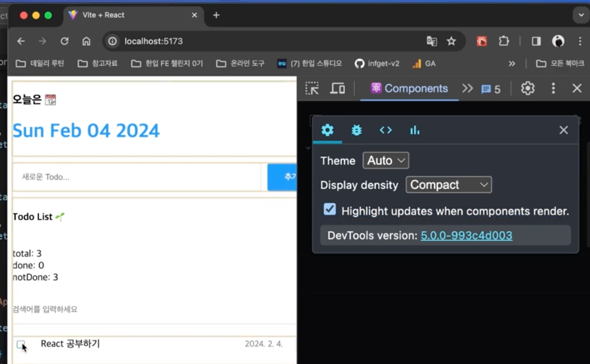

# 최적화

웹 서비스의 성능 개선

## useMemo

- 메모이제이션을 기반으로 동일한 연산 반복 안하도록 하기

- 불필요한 연산 줄이기

---

#### 1. 코드 적용

1. **Todo 상태 분석 (`useMemo`)**:

   - 등록된 Todo의 **전체 개수**, **완료된 개수**, **미완료된 개수**를 계산.
   - **코드**:

     ```js
     const { totalCount, doneCount, notDoneCount } = useMemo(() => {
       console.log("getAnalyzedData 호출!")
       const totalCount = todos.length // 전체 개수
       const doneCount = todos.filter((todo) => todo.isDone).length // 완료된 개수
       const notDoneCount = totalCount - doneCount // 미완료된 개수

       return { totalCount, doneCount, notDoneCount }
     }, [todos]) // 의존성 배열에 todos 추가
     ```

2. **데이터 검색과 필터링**:

   - **검색어 입력**에 따라 Todo 데이터를 필터링.
   - 필터링된 데이터를 렌더링.
   - **코드**:

     ```js
     const getFilteredData = () => {
       if (search === "") {
         return todos
       }
       return todos.filter((todo) => todo.content.toLowerCase().includes(search.toLowerCase()))
     }

     const filteredTodos = getFilteredData()
     ```

3. **렌더링**:
   - **분석된 데이터**를 UI로 출력:
     ```js
     <div>
       <div>total: {totalCount}</div>
       <div>done: {doneCount}</div>
       <div>notDone: {notDoneCount}</div>
     </div>
     ```

---

#### 2. 주요 코드 비교

| 기능             | `useMemo` 적용 전         | `useMemo` 적용 후                   |
| ---------------- | ------------------------- | ----------------------------------- |
| 데이터 분석      | 매 렌더링마다 계산        | `todos` 변경 시에만 계산            |
| 성능 최적화      | 계산 반복으로 비효율 발생 | 메모이제이션으로 불필요한 계산 방지 |
| 의존성 배열 관리 | N/A                       | `[todos]`로 의존성 명시             |

---

#### 3. 주요 복습 포인트

1. **`useMemo` 문법**:

   ```js
   const memoizedValue = useMemo(() => {
     // 연산 수행
     return 계산된 값;
   }, [의존성 배열]); // 의존성 값이 변경될 때만 재계산
   ```

2. **적용 위치**:

   - **연산 비용이 큰 계산**이나 **동일한 값의 반복적인 계산**을 피하기 위해 사용.

3. **성능 최적화 효과**:
   - 불필요한 재계산 방지.
   - 특정 상태가 변경될 때만 계산 수행.

---

#### 4. 이 코드를 활용한 학습 포인트

- **Todo 상태 분석**:
  - 완료된 Todo, 미완료된 Todo, 전체 Todo 개수를 효율적으로 계산.
- **검색과 필터링**:
  - `filteredTodos`로 필터링된 데이터를 렌더링.
- **UI 성능 최적화**:
  - 계산이 자주 호출되지 않도록 `useMemo`로 최적화.

---

## React.memo와 컴포넌트 렌더링 최적화

- 컴포넌트를 인수로 받아 최적화

- 부모 컴포넌트가 리렌더딩 -> props가 변경되지 않았다면 자식컴포넌트의 리렌더링 방지

- 리액트 개발자 도구

  - Highlight updates when components render
    - 컴포넌트가 리렌더링 될 때 하이라이트 표시

  

#### 1. 사용법

1. **React.memo 기본 사용**

   - `React.memo`로 컴포넌트를 감싸면 **props가 변경되지 않을 때** 리렌더링을 방지.
   - **코드**:

     ```js
     import { memo } from "react"

     const Header = () => {
       return <h1>오늘 날짜는 {new Date().toDateString()}</h1>
     }

     export default memo(Header)
     ```

2. **React.memo + props 비교 함수**

   - `React.memo`의 두 번째 인자로 **props 비교 함수**를 전달해 **리렌더링 조건**을 세밀하게 조정.
   - **코드**:
     ```js
     export default memo(TodoItem, (prevProps, nextProps) => {
       // Props 변경 여부 판단
       return prevProps.id === nextProps.id && prevProps.isDone === nextProps.isDone && prevProps.content === nextProps.content && prevProps.date === nextProps.date
     })
     ```

3. **주의점: React.memo의 얕은 비교**
   - 기본적으로 **얕은 비교**를 수행하여 **객체 타입 props**의 내부 값은 비교하지 않음.
   - **해결법**:
     1. `useMemo`나 `useCallback`으로 props 값을 메모이제이션.
     2. 비교 함수로 props를 직접 비교.

---

#### 2. 주요 코드 설명

1. **Header 컴포넌트 (React.memo)**:

   - 날짜를 표시하는 **Header 컴포넌트**는 props가 변경되지 않으면 리렌더링을 방지.
   - **코드**:

     ```js
     const Header = () => {
       return (
         <div className="Header">
           <h3>오늘은 📆</h3>
           <h1>{new Date().toDateString()}</h1>
         </div>
       )
     }

     export default memo(Header)
     ```

2. **TodoItem 컴포넌트 (React.memo + 깊은 비교)**:

   - Todo의 내용, 상태, 날짜 등의 변화가 없으면 리렌더링을 방지.
   - **코드**:
     ```js
     export default memo(TodoItem, (prevProps, nextProps) => {
       return prevProps.id === nextProps.id && prevProps.isDone === nextProps.isDone && prevProps.content === nextProps.content && prevProps.date === nextProps.date
     })
     ```

3. **React.memo의 기본 동작**:
   - 기본적으로 **props 변경 여부를 얕은 비교**로 판단.
   - props가 객체나 함수일 경우 매번 새로운 참조를 가리켜 리렌더링 가능.

---

#### 3. 최적화 요약

| 기능                           | 설명                                                               |
| ------------------------------ | ------------------------------------------------------------------ |
| **React.memo**                 | props가 변경되지 않으면 컴포넌트를 메모이제이션하여 리렌더링 방지. |
| **얕은 비교**                  | 기본적으로 props의 얕은 비교 수행.                                 |
| **props 비교 함수**            | `memo(Component, 비교 함수)`로 props의 깊은 비교 수행 가능.        |
| **useMemo / useCallback 사용** | 객체나 함수 props를 메모이제이션하여 불필요한 리렌더링 방지.       |

---

#### 4. 복습 포인트

1. **React.memo 기본 사용**:
   - `memo(Component)`로 컴포넌트를 감싸서 props 변경 시에만 리렌더링.
2. **props 비교 함수 추가**:
   - `memo(Component, 비교 함수)`로 props를 세밀하게 비교.
3. **얕은 비교의 한계 해결**:
   - `useMemo`와 `useCallback`으로 props를 메모이제이션하여 최적화.

---

## useCallback과 함수 재생성 방지

- memo메서드는 매 컴포넌트마다 적용해야해서 귀찮음 -> useCallback!!

---

#### 1. 사용법

1. **기본 구조**:

   ```js
   const memoizedCallback = useCallback(
     () => {
       // 메모이제이션된 함수 로직
     },
     [deps] // 의존성 배열
   )
   ```

2. **의존성 배열 (deps)**:
   - 배열 내 값이 변경되면 함수가 새로 생성.
   - 빈 배열(`[]`)을 넣으면 컴포넌트가 처음 렌더링될 때 한 번만 생성.

---

#### 2. 코드 적용

1. **`onCreate` 함수**:

   - 새로운 Todo를 추가.
   - 메모이제이션된 함수를 통해 재생성 방지.
   - **코드**:
     ```js
     const onCreate = useCallback((content) => {
       dispatch({
         type: "CREATE",
         data: {
           id: idRef.current++,
           isDone: false,
           content: content,
           date: new Date().getTime(),
         },
       })
     }, []) // 의존성 배열이 빈 배열이므로 최초 렌더링 시에만 생성
     ```

2. **`onUpdate` 함수**:

   - Todo 상태(isDone) 업데이트.
   - **코드**:
     ```js
     const onUpdate = useCallback((targetId) => {
       dispatch({
         type: "UPDATE",
         targetId: targetId,
       })
     }, []) // 의존성 배열
     ```

3. **`onDelete` 함수**:
   - Todo 삭제 처리.
   - **코드**:
     ```js
     const onDelete = useCallback((targetId) => {
       dispatch({
         type: "DELETE",
         targetId: targetId,
       })
     }, []) // 의존성 배열
     ```

---

#### 3. 주요 코드 비교

| **기능**    | **기존 함수**                               | **`useCallback` 사용**                       |
| ----------- | ------------------------------------------- | -------------------------------------------- |
| 생성 시점   | 렌더링될 때마다 새로 생성                   | 의존성 배열이 변경될 때만 새로 생성          |
| 성능 최적화 | 자식 컴포넌트가 매번 리렌더링될 가능성 있음 | 자식 컴포넌트가 불필요하게 리렌더링되지 않음 |

---

#### 5. 복습 포인트

1. **`useCallback` 문법**:

   ```js
   const memoizedFunction = useCallback(() => {
     // 로직
   }, [deps])
   ```

2. **적용 위치**:

   - 자식 컴포넌트에 전달되는 함수 props.
   - 의존성이 적은 상태에서 주로 사용.

3. **성능 최적화 효과**:
   - 동일한 참조를 유지해 자식 컴포넌트의 불필요한 리렌더링 방지.
   - 렌더링 비용 감소.

---

## 최적화

1. 기능 구현 -> 2. 최적화

2. 최적화 대상

- 복잡한 컴포넌트정도만 최적화 수행 권장

- 최적화가 필요한 것만 하기

- 아티클 "When to use useMemo, useCallback"

  https://goongoguma.github.io/2021/04/26/When-to-useMemo-and-useCallback/
