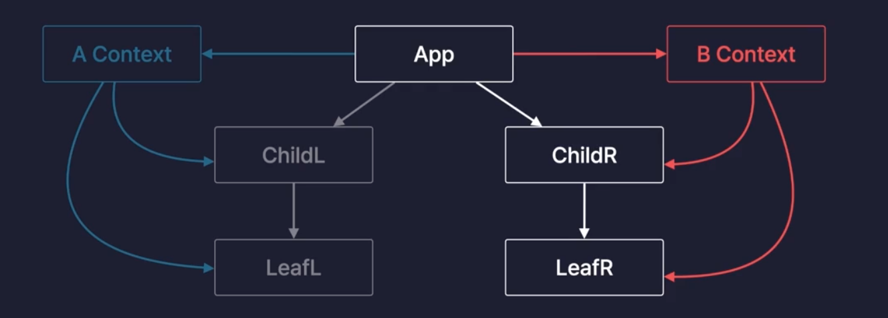
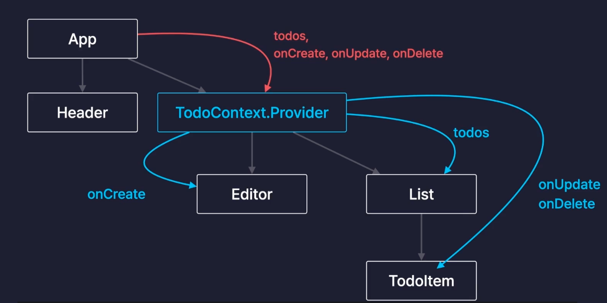
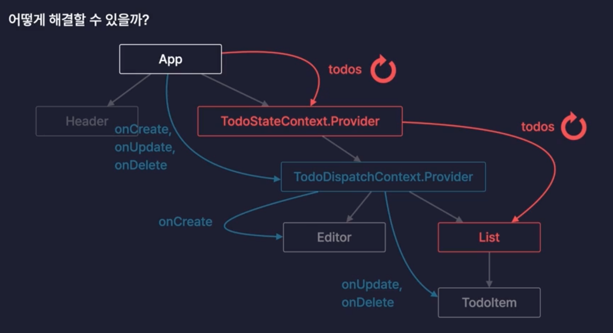

# Context

컴포넌트간 데이터를 전달하는 방법

- props

  - 부모 -> 자식으로만 데이터 전달 가능
  - 중간 컴포넌트에 전달하는 경우 불편 (props drilling)

- Context

  - 데이터 보관소(객체 형태로 보관)
  - 데이터가 필요한 컴포넌트에 바로 전달 -> prop drilling을 해결
  - 하나의 리액트 프로젝트에 Context N개 가능 (컴포넌트 별로 Context 분리 가능)

    

## Context 사용하기

- 컴포넌트 외부에서 생성 -> 내부에서 선언하면 불필요한 렌더링 발생

- todo 리스트에서 context 사용했을 때 구조

  

#### 1. 코드 구조 및 사용법

1. **`Context` 생성**

   - **`createContext`**로 Context 객체를 생성.
   - **위치**: 컴포넌트 외부에 선언하여 불필요한 재생성 방지.
   - **코드**:
     ```js
     export const TodoStateContext = createContext()
     export const TodoDispatchContext = createContext()
     ```

2. **`Provider`로 데이터 공급**

   - `value` 속성으로 Context 데이터를 공급.
   - **코드**:
     ```js
     <TodoStateContext.Provider value={todos}>
       <TodoDispatchContext.Provider value={memoizedDispatch}>
         <Editor />
         <List />
       </TodoDispatchContext.Provider>
     </TodoStateContext.Provider>
     ```

3. **`useContext`로 데이터 소비**
   - Context 데이터를 가져와 사용.
   - **예시**:
     - **`Editor`에서 `onCreate` 가져오기**:
       ```js
       const { onCreate } = useContext(TodoDispatchContext)
       ```
     - **`List`에서 `todos` 가져오기**:
       ```js
       const todos = useContext(TodoStateContext)
       ```

---

#### 2. 컴포넌트별 Context 활용

1. **App 컴포넌트**:

   - Context 생성 및 데이터 공급.
   - **코드 요약**:
     ```js
     <TodoStateContext.Provider value={todos}>
       <TodoDispatchContext.Provider value={memoizedDispatch}>
         <Editor />
         <List />
       </TodoDispatchContext.Provider>
     </TodoStateContext.Provider>
     ```

2. **Editor 컴포넌트**:

   - Context로 `onCreate` 함수 가져와 Todo 생성.
   - **코드 요약**:
     ```js
     const { onCreate } = useContext(TodoDispatchContext)
     onCreate(content)
     ```

3. **List 컴포넌트**:

   - Context로 `todos` 가져와 Todo 리스트 렌더링.
   - **코드 요약**:
     ```js
     const todos = useContext(TodoStateContext)
     const filteredTodos = getFilteredData() // 검색어 필터링
     ```

4. **TodoItem 컴포넌트**:
   - Context로 `onUpdate`, `onDelete` 가져와 Todo 상태 업데이트/삭제.
   - **코드 요약**:
     ```js
     const { onUpdate, onDelete } = useContext(TodoDispatchContext)
     ```

---

#### 3. 주요 코드 비교

| 기능           | Context 미사용                        | Context 사용                                           |
| -------------- | ------------------------------------- | ------------------------------------------------------ |
| 데이터 전달    | `props`로 각 컴포넌트에 전달          | Context로 전역 상태 공유                               |
| Props Drilling | 부모 → 자식 → 손자 순으로 전달        | 불필요한 `props` 전달 없이 필요 컴포넌트에서 직접 접근 |
| 데이터 소비    | 각 컴포넌트에서 `props`로 데이터 접근 | `useContext`로 데이터 접근                             |

---

#### 4. 최적화 포인트

1. **불필요한 재생성 방지**:

   - `useMemo`로 `dispatch` 객체 메모이제이션.
     ```js
     const memoizedDispatch = useMemo(() => {
       return { onCreate, onUpdate, onDelete }
     }, [])
     ```

2. **컴포넌트별 데이터 분리**:

   - **상태 데이터**: `TodoStateContext`.
   - **상태 변경 함수**: `TodoDispatchContext`.

3. **Props Drilling 방지**:
   - Context를 활용해 필요할 때만 데이터 접근.

---

#### 5. 복습 포인트

1. **Context 생성 및 사용**:

   - `createContext` → `Provider`로 데이터 공급 → `useContext`로 데이터 소비.

2. **Context와 최적화**:

   - `useMemo`로 Context 데이터를 메모이제이션하여 성능 개선.

3. **Props Drilling 해결**:
   - Context를 통해 필요한 컴포넌트에서만 데이터 접근.

---

## Context 분리하기

- Context를 사용했는데 왜 이전에 적용했던 최적화인 memo()가 풀렸을까??

  - `App.jsx`가 Context를 사용하고 있기 때문에 App 컴포넌트가 리렌더링 될 때마다 `Context.Provider`도 새로 생성(객체 자체가 다시 생성)되어 전체 컴포넌트가 리렌더링 됨

  - Context를 분리하면 필요한 데이터만 전달받아 사용할 수 있음

    

    - TodoStateContext: 변경될 수 있는 값에 사용
      - todos, todoDispatch
    - TodoDispatchContext: 변경할 수 있는 값에 사용
      - oncreate, onUpdate, onDelete

#### 1. Context 분리 방법

1. **Context 생성**

   - **State와 Dispatch Context 분리**:
     ```js
     export const TodoStateContext = createContext() // 상태를 관리하는 Context
     export const TodoDispatchContext = createContext() // 동작(함수)을 관리하는 Context
     ```

2. **Provider로 데이터 공급**

   - 상태와 동작을 **별도의 Provider**로 나누어 필요한 데이터만 공급.
   - **코드**:
     ```js
     <TodoStateContext.Provider value={todos}>
       <TodoDispatchContext.Provider value={memoizedDispatch}>
         <Editor />
         <List />
       </TodoDispatchContext.Provider>
     </TodoStateContext.Provider>
     ```

3. **useContext로 데이터 소비**
   - 필요한 Context만 가져와 사용하여 불필요한 데이터 참조 방지.
   - **예시**:
     - `Editor` 컴포넌트에서 `onCreate` 함수만 사용:
       ```js
       const { onCreate } = useContext(TodoDispatchContext)
       ```
     - `List` 컴포넌트에서 `todos` 상태만 사용:
       ```js
       const todos = useContext(TodoStateContext)
       ```

---

#### 2. 컴포넌트별 Context 사용

1. **App 컴포넌트**:


    - Context를 생성하고 데이터를 공급.
    - 상태 변경 함수를 `useMemo`로 메모이제이션하여 최적화.
    - **코드 요약**:
      ```js
      const memoizedDispatch = useMemo(() => ({ onCreate, onUpdate, onDelete }), []);

      <TodoStateContext.Provider value={todos}>
        <TodoDispatchContext.Provider value={memoizedDispatch}>
          <Editor />
          <List />
        </TodoDispatchContext.Provider>
      </TodoStateContext.Provider>
      ```

2. **Editor 컴포넌트**:


    - `TodoDispatchContext`에서 `onCreate` 함수만 가져와 Todo 생성.
    - **코드 요약**:
      ```js
      const { onCreate } = useContext(TodoDispatchContext);
      ```

3. **List 컴포넌트**:


    - `TodoStateContext`에서 `todos` 상태를 가져와 리스트를 필터링하고 렌더링.
    - **코드 요약**:
      ```js
      const todos = useContext(TodoStateContext);
      ```

4. **TodoItem 컴포넌트**:


    - `TodoDispatchContext`에서 `onUpdate`와 `onDelete` 함수만 가져와 사용.
    - **코드 요약**:
      ```js
      const { onUpdate, onDelete } = useContext(TodoDispatchContext);
      ```

---

#### 3. 최적화 포인트

1. **State와 Dispatch 분리**:


    - 상태와 동작을 별도로 관리하여 컴포넌트 간 의존성을 줄임.

2. **`useMemo`로 최적화**:


    - `memoizedDispatch`로 `onCreate`, `onUpdate`, `onDelete`를 메모이제이션하여 불필요한 함수 재생성 방지.

3. **필요한 데이터만 소비**:


    - `useContext`로 필요한 데이터만 가져와 사용하여 성능 최적화.

---

#### 4. 복습 포인트

1. **Context 생성 및 분리**:


    - `createContext`로 State와 Dispatch를 각각 생성.

2. **Provider 설정**:


    - `TodoStateContext.Provider`와 `TodoDispatchContext.Provider`로 데이터 공급.

3. **useContext 사용**:


    - 필요한 Context만 가져와 사용하여 컴포넌트 간 의존성 최소화.
