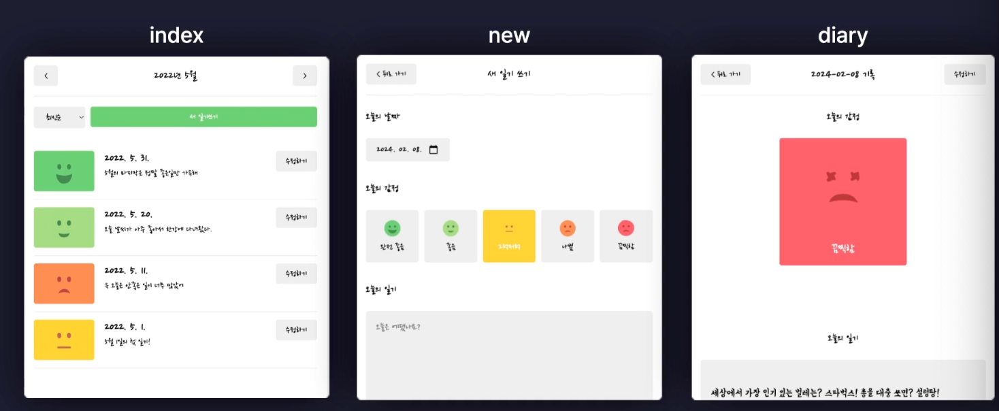
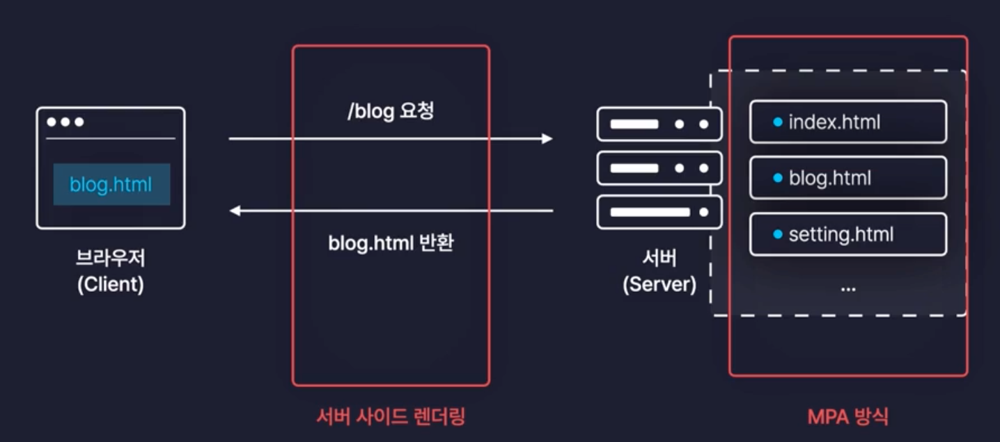
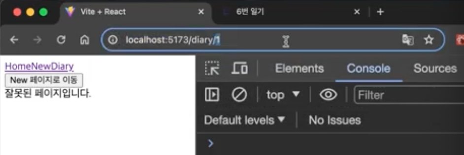
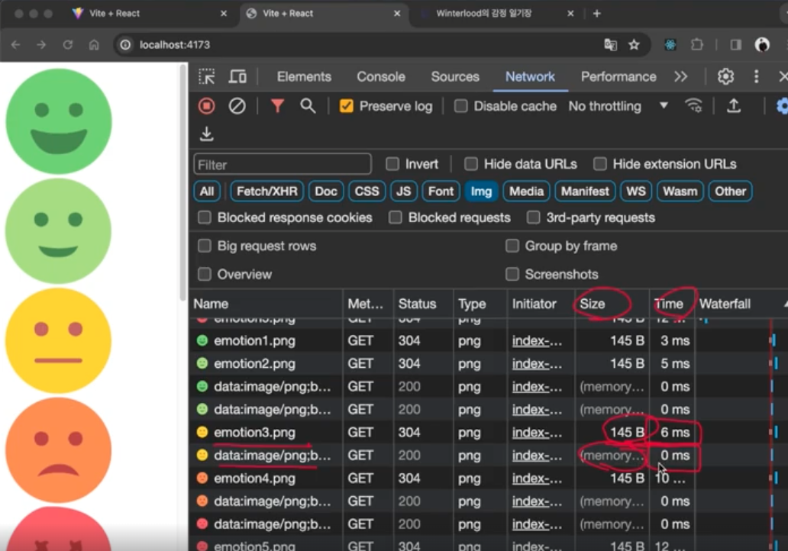

# 프로젝트 3: 감정 일기장

감정일기장 데모사이트 링크 :

https://emotion-diary.winterlood.com/

## 페이지 라우팅 1. 소개

- 페이지 : index, new, diary
  

- 페이지 라우팅 : 경로에 따라 알맞은 페이지를 렌더링하는 과정

  - MPA : 요청이 오면 서버가 html을 렌더링하여 전달 -> 페이지 이동이 쾌적 x, 서버 부하가 심함
  - SSR : 완성된 html을 서버 측에서 렌더링하여 전달
    

  -> so, 리액트는 SPA 방식을 사용하여 CSR 렌더링하고 페이지 라우팅을 구현

  - SPA
    : 페이지 이동 시 필요한 데이터만(자바스크립트 파일이 `번들링`돼서 전달=리액트 앱) 받아와서 CSR 렌더링 -> 빠른 페이지 이동, 서버 부하 감소

## 페이지 라우팅 2. 라우팅 설정하기

### 리액트 라우터 라이브러리 사용!!!

#### 1. 설치

- 버전 6이상으로 하기

```bash
$ npm install react-router-dom
```

#### 2. 라우터 설정

- main.js

```jsx
import { BrowserRouter, Route } from "react-router-dom"
```

- `<BrowserRouter>`로 `<App />` 감싸기

```jsx
ReactDOM.createRoot(document.getElementById("root")).render(
  <BrowserRouter>
    <App />
  </BrowserRouter>
)
```

#### 3. 라우터 컴포넌트 모아두기

- src/pages 폴더 생성

  - Home.jsx, New.jsx, Diary.js 생성
  - ```jsx
    const Home = () => {
      return <div>Home</div>
    }

    export default Home
    ```

#### 4. App.js에서 라우터 설정

- **`<Routes>`**: 여러 경로를 관리하는 컨테이너.
- **`<Route>`**: 각 경로와 렌더링할 컴포넌트를 연결.

- `<Route path="경로" element={컴포넌트} />`로 경로와 컴포넌트 연결
- `path="*"`로 잘못된 경로를 처리, 와일드 카드 `*` 사용.

---

```jsx
<Routes>
  {/* path : 경로 element : 렌더링 하고자하는 컴포넌트 */}
  <Route path="/" element={<Home />} /> {/* 홈 화면 */}
  <Route path="/new" element={<New />} /> {/* 새 일기 작성 */}
  <Route path="/diary" element={<Diary />} /> {/* 일기 상세 조회 */}
  <Route path="*" element={<Notfound />} /> {/* 잘못된 경로 처리*/}
</Routes>
```

---

## 페이지 라우팅 3. 페이지 이동



### `<Link>`

- 페이지 이동을 위한 컴포넌트

- `<Link>` : CSR 방식으로 페이지 이동하기

- `<a>` : SSR 방식으로 로딩되어 불편함

---

```jsx
import { Link } from "react-router-dom"

function App() {
  return (
    <div>
      <Link to={"/"}>Home</Link>
      <Link to={"/new"}>New</Link>
      <Link to={"/diary"}>Diary</Link>
    </div>
  )
}
```

### `useNavigate()`

- 이벤트 핸들러 함수 내에서 페이지 이동을 위한 훅

---

```jsx
import { useNavigate } from "react-router-dom"

function App() {
  const navigate = useNavigate()

  // New페이지로 이동 버튼을 누르면 이벤트 발생하면서 /new로 이동
  const onClickButton = () => {
    nav("/new")

    return <button onClick={onClickButton}>New 페이지로 이동</button>
  }
}
```

## 페이지 라우팅 4. 동적 경로

- 동적인 데이터를 포함하고 있는 경로
  - URL 파라미터 : `/diary/1`, `/diary/2` // 잦은 변경
  - 쿼리스트링 : `/diary?id=1`, `/diary?id=2` // 드문 변경

### 코드

1. URL에 **:id**를 포함해 동적으로 값을 전달.

```jsx
<Route path="/diary/:id" element={<Diary />} />
```

2. 동적 경로 값 조회

- useParams 훅으로 URL에 포함된 동적 값을 가져옴.

```jsx
import { useParams } from "react-router-dom"

const Diary = () => {
  const params = useParams()
  return <div>{params.id}번 일기입니다 ~~</div>
}
```

---

## 폰트, 이미지, 레이아웃 설정하기

### 폰트 불러오기

1. public 폴더(정적 파일 저장)에 폰트 파일 저장

2. index.css에 폰트 설정

```css
@font-face {
  font-family: "NanumPenScript";
  src: url("/NanumPenScript-Regular.ttf");
}
```

### 이미지 파일 불러오기

#### 1. src/assets 폴더

1. src/assets 폴더에 이미지 파일 저장

- URI 포멧이어서 최적화.. 즉, 이미지가 캐시되어 빠르게 로딩 -> 이미지 적을 때 사용

2. 컴포넌트에서 이미지 불러오기

```jsx
import logo from "../assets/logo.png"

const Header = () => {
  return 
}
```

#### 2. public 폴더에서 이미지 저장

- url로 불러오기

- 이미지가 매번 로딩 -> 이미지 많을 때 사용

```jsx

```

- but, vite의 이미지 최적화가 적용 안됨..

- 개발자 도구 -> 네트워크탭 -> img -> size 에서 확인 ㅇ

  

  - src/assets에 이미지 저장 -> 메모리 캐싱
  - public에 이미지 저장 -> 매번 불러옴

---

-> 프로젝트를 빌드해보면 차이 알 수 ㅇ

-> src/assets에 이미지 저장하는 것이 좋음.

#### 3. util 폴더 생성

- 공통으로 사용하는 컴포넌트를 모아두는 폴더

#### 프로젝트 빌드

1. 명령어

```bash
$ npm run build
```

2. dist 폴더 생성

- 빌드 결과물이 저장되는 폴더
- 빌드 결과물 보는 명령어

```bash
$ npm run preview
```

#### 4. index.css에서 메인 컨테이너 스타일 설정

## 공통 컴포넌트 구현

### 1. components 폴더 생성

- src/components 폴더 생성
  - `.jsx`, `.css` 파일 생성
  - `white-space: nowrap;` : 버튼안의 글씨가 반응형이 되어도 버튼 글씨가 밑으로 안 내려감

### 2. .jsx 파일 설정

1. 상위 컴포넌트에서 props로 받아온 값을 구조분해 할당으로 화면에 렌더링

```jsx
// 상위 컴포넌트에서 title, leftChild, rightChild를 props로 받아와서 화면에 렌더링
const Header = ({ title, leftChild, rightChild }) => {
  return (
    <header className="Header">
      <div className="header_left">{leftChild}</div>
      <div className="header_center">{title}</div>
      <div className="header_right">{rightChild}</div>
    </header>
  )
}

export default Header
```

2. 상위 컴포넌트에서는 props로 받아온 값을 Header 컴포넌트에 전달

```jsx
<Header title={"Header"} leftChild={<Button text={"Left"} />} rightChild={<Button text={"Right"} />} />
```

### 3. .css 파일 설정

1. 컴포넌트에서 css 불러오기

```jsx
import "./Header.css"
```

2. css 파일 작성

## 일기 관리 기능 구현하기 1

### 일기 데이터 관리

#### 1. `useReducer` 훅을 사용하여 일기 데이터 관리

```jsx
import { useReducer } from "react"
```

#### 2. reducer 함수 작성

```jsx
function reducer(state, action) {
  return state
}
```

#### 3. 컴포넌트에 랜더링

```jsx
function App() {
  // useReducer() 훅을 사용해서 데이터를 관리
  //useReducer(reducer함수, 임시 일기 데이터)
  const [data, dispatch] = useReducer(reducer, mockData)
}
```

#### 4. moxkData 작성

- 일기 데이터의 초기값

  ```jsx
  // 임시 일기 데이터
  const mockData = [
    {
      id: 1,
      createdDate: new Date().getTime(), // 타임스템프로 날짜 생성
      emotionId: 1,
      content: "1번 일기 내용",
    },
  ]
  ```

## 일기 관리 기능 구현하기 2

- 일기 데이터 추가, 수정, 삭제

---

### 일기 데이터 추가

1. reducer 함수 작성

```jsx
function reducer(state, action) {
  switch (action.type) {
    case "CREATE":
      return [action.data, ...state] // 새로운 데이터 + 기존 데이터
    default:
      return state
  }
}
```

2. 일기 추가 함수 작성

- 새로운 일기를 추가하기 위해 dispatch 호출

```jsx
function App() {
  // 일기 추가가 되면 data에 추가되는데, 이때 useReducer 훅을 사용하여 상태를 관리
  const [data, dispatch] = useReducer(reducer, mockData)
  const idRef = useRef(3) // id값을 관리하기 위한 useRef

  // 새로운 일기 추가
  const onCreate = (createdDate, emotionId, content) => {
  dispatch({
    type: "CREATE", // 액션 타입
    data: {
      id: idRef.current++, // 고유 ID 생성
      createdDate,
      emotionId,
      content,
    },
  });
};
```

3. 일기 추가 버튼

```jsx
<button
  onClick={() => {
    onCreate(new Date().getTime(), 1, "Hello")
  }}
>
  일기 추가 테스트
</button>
```

---

#### id값 관리

1. useRef 훅을 사용하여 id값 관리

```jsx
import { useRef } from "react"
```

2. idRef.current++로 id값을 관리

```jsx
const idRef = useRef(3) // id값을 관리하기 위한 useRef
```

---

### 일기 데이터 수정, 삭제

1. 수정, 삭제 함수 작성

- 컴포넌트를 렌더링하는 함수 안에 작성 ->
- useReducer 훅으로 일기 데이터를 관리하고 있으므로 데이터 변경 시, dispatch 함수를 사용하여 action 객체를 전달

2. reducer 함수 작성

- action 객체의 type에 따라 데이터를 수정, 삭제
- switch문으로 action.type에 따라 다른 작업을 수행

3. 컴포넌트 렌더링하는 함수의 return 부분에 수정, 삭제 함수를 전달

- 기능을 적용하고 싶은 태그에 넣기
- 일기 수정, 삭제하는 함수를 이벤트 핸들러로 적용

---

### 일기 데이터와 일기 관련 함수를 하위 컴포넌트에 전달

1. `createContext`을 사용하여 상위 컴포넌트의 데이터를 하위 컴포넌트에 전달

```jsx
import { createContext } from "react"
```

2. `createContext()` 함수로 데이터를 전달할 컨텍스트 생성

```jsx
// 일기 데이터, 일기 데이터 관련 함수도 Context를 통해서 다른 컴포넌트에 전달
const DiaryStateContext = createContext() // 일기데이터
const DiaryDispatchContext = createContext() // 일기데이터 관련 함수
```

3. 라우트 컴포넌트 아래에 있는 모든 페이지 컴포넌트에 데이터 전달

- 라우트 컴포넌트 바깥에 `<StateContext.Provide>`로 감싸기
- value에 데이터 전달

```jsx
<DiaryStateContext.Provider value={data}>
  <DiaryDispatchContext.Provider value={(onCreate, onUpdate, onDelete)}>
    {/* 라우터들~~~ */}
  </DiaryDispatchContext.Provider>
</DiaryStateContext.Provider>
```

## Home 페이지 구현하기 1. UI

1. Home 페이지 구현
- 하위 컴포넌트로 DiaryList 컴포넌트를 렌더링

2. DiaryList 컴포넌트 구현
- jsx, css 파일 생성

3. DiaryItem 컴포넌트 구현
- jsx, css 파일 생성

Sort 메서드 비교함수 관련 아티클

https://developer.mozilla.org/ko/docs/Web/JavaScript/Reference/Global_Objects/Array/sort

## Home 페이지 구현하기 2. 기능

## Home 페이지 구현하기 3. 회고

## New 페이지 구현하기 1. UI

## New 페이지 구현하기 2. 기능

## Edit 페이지 구현하기 1. UI

## Diary 페이지 구현하기
